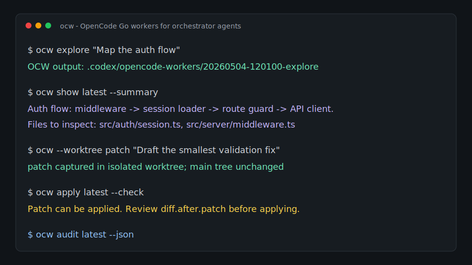

# ocw

[](https://github.com/BenitoJD/OCW-CLI/actions/workflows/ci.yml)
[](https://github.com/BenitoJD/OCW-CLI/releases)
[](LICENSE)
[](https://securityscorecards.dev/viewer/?uri=github.com/BenitoJD/OCW-CLI)

`ocw` is an OpenCode Go worker runtime for Codex-style orchestration.

The idea is simple: keep Codex as the orchestrator and final reviewer, while using cheaper OpenCode Go models for bounded worker tasks, structured MCP tools, and optional Codex-native OSS subagents through OCW Bridge.



## About

`ocw` is for developers who want to reduce expensive agent usage without giving up the judgment of their primary coding agent.

It does not replace Codex, Claude Code, or another orchestrator. Instead, it gives those agents a shell CLI, a stdio MCP server, and an optional Responses-compatible bridge for delegating narrow tasks to OpenCode Go workers. Results are saved as summaries, metadata, status snapshots, and diffs that the primary agent can inspect.

Use it when you want:

- cheap first-pass codebase exploration
- broad or long-context scans
- a second review pass on a diff
- bounded patch drafts in an isolated worktree
- repeatable worker artifacts that are easy for another agent to read
- Codex-native OSS subagents backed by OpenCode Go models
- a cost/savings ledger and final-review gate around worker output

The safety model is intentionally conservative: worker output is draft labor. Your main agent, your tests, and your code review remain the final authority.

## Install

Install from a GitHub Release:

```bash
curl -fsSL https://raw.githubusercontent.com/BenitoJD/OCW-CLI/main/scripts/install-release.sh | bash
```

The release installer downloads the tarball, verifies its SHA-256 file, verifies GitHub artifact attestations when `gh` is installed, and runs the packaged installer.

Require attestation verification:

```bash
curl -fsSL https://raw.githubusercontent.com/BenitoJD/OCW-CLI/main/scripts/install-release.sh | bash -s -- --require-attestation
```

Install with Homebrew:

```bash
brew install BenitoJD/ocw/ocw
```

If Homebrew appears to hang after printing OCW metadata, the usual cause is local macOS Xcode discovery waiting on Spotlight `mdfind`, not OCW. Use the release installer above while repairing Homebrew, then run:

```bash
ocw homebrew doctor
```

Or install from this repository:

```bash
./install.sh
```

This symlinks `bin/ocw` into `~/.local/bin/ocw`.

Generate a Homebrew formula for a tap:

```bash
make package
ocw homebrew formula --out Formula/ocw.rb
```

Docs site source:

```text
docs/site/index.html
```

Requirements:

- `opencode`
- `git`
- `gh` for `ocw pr ...`
- `node` for `ocw mcp`
- `python3` for `ocw bridge`
- `jq` optional, but recommended for clean `summary.md` extraction

Check your setup:

```bash
ocw quickstart
ocw doctor
ocw doctor --deep
ocw doctor --deep --json
ocw doctor --fix
ocw setup all
ocw bridge doctor
```

Uninstall:

```bash
ocw uninstall
ocw uninstall --yes
ocw uninstall --all --yes
```

`ocw uninstall` is a dry run by default. `--yes` removes the installed launcher and global skills. `--all --yes` also removes project OCW files in the current directory, including `.ocw.toml`, OCW project instructions, project skills, default OCW agent-pack files, and OCW `.gitignore` entries. Modified project instruction/config files are kept unless you pass `--force`.

Bootstrap a project:

```bash
ocw init
ocw init --project-skills
ocw agent-pack install
ocw agents sync
```

This installs `.ocw.toml`, `.gitignore` entries, Codex and Claude Code project instructions, reusable personal skills, optional project-local skills, and optional OpenCode agents. `ocw agents sync|diff|doctor` is the easiest project-local integration flow when you want repeatable setup across many repos.

`ocw setup all` also installs project MCP config, Claude worker subagent files,
OCW Bridge runtime/config, bridge-backed Codex agent templates, and the bridge
orchestration routing pack.

Enable Codex-native OSS subagents through OCW Bridge:

```bash
ocw bridge install
ocw bridge agents sync
ocw bridge orchestration sync
ocw bridge codex-config --write --project
ocw bridge start
ocw bridge test
```

The bridge runs a localhost Responses-compatible proxy so Codex can use OpenCode Go models as native model-provider agents. It is bundled from `opencode-bridge` with Apache-2.0 attribution. See `docs/bridge.md`.

`ocw bridge install` also installs the upstream-style OSS helper scripts as
OCW-native tools:

```bash
.codex/ocw-bridge/bin/oss-scout --task .ai/tasks/map-auth.md
.codex/ocw-bridge/bin/oss-review --task .ai/tasks/review-risk.md
.codex/ocw-bridge/bin/oss-docs --task .ai/tasks/docs.md
.codex/ocw-bridge/bin/oss-patch --task .ai/tasks/fix-bug.md
```

Reports go to `.codex/ocw-bridge-results/`; patch drafts run in isolated
`.codex/ocw-bridge-worktrees/` worktrees and produce patch files for review.

Bridge runtime calls stream like native Responses calls: Codex receives
`response.created` immediately, heartbeat comments while OpenCode Go is still
working, and final output when the upstream model completes. This is important
for long worker turns that would otherwise appear idle.

Config helpers:

```bash
ocw config path
ocw config show
ocw config validate --json
ocw config init --force
```

## Usage

```bash
ocw delegate "Find the likely files for this bug"
ocw delegate --mode review "Review the current diff for concrete bugs"
ocw delegate --mode patch "Draft the smallest isolated fix"
ocw verdict latest
ocw savings
ocw backend doctor
```

`ocw delegate` chooses a worker mode from the task when you do not pass
`--mode`. Patch delegation defaults to an isolated git worktree. `ocw verdict`
keeps final review explicit; worker output remains draft labor.

```bash
ocw explore "Find where auth errors are handled"
ocw cheap "Summarize this small config flow"
ocw scan "Map the billing flow across the repo"
ocw review "Review the current diff for regressions"
ocw --worktree patch "Draft the smallest safe fix for the failing validation"
```

Default routing:

```text
explore -> opencode-go/deepseek-v4-flash
review  -> opencode-go/deepseek-v4-pro
patch   -> opencode-go/kimi-k2.6
scan    -> opencode-go/mimo-v2.5
cheap   -> opencode-go/qwen3.5-plus
```

Override anything:

```bash
ocw --model opencode-go/minimax-m2.7 --agent build cheap "Try a second opinion"
ocw cheap --model opencode-go/minimax-m2.7 --agent build "Same override, mode first"
ocw --variant high explore "Map the API flow"
ocw --attach http://localhost:4096 scan "Map the billing flow"
ocw --file ./notes.md review "Review this plan"
```

Install OpenCode-native worker agents:

```bash
ocw agent-pack install
```

This creates:

```text
.opencode/agents/ocw-explorer.md
.opencode/agents/ocw-reviewer.md
.opencode/agents/ocw-patcher.md
.opencode/agents/ocw-triage.md
```

Run a small model benchmark:

```bash
ocw bench --models opencode-go/qwen3.5-plus,opencode-go/deepseek-v4-flash --iterations 2
```

Sync/list OpenCode Go models and promote benchmark winners into project routes:

```bash
ocw models sync
ocw models list
ocw models list --metadata
ocw models profiles
ocw models recommend patch --profile balanced
ocw models configure balanced
ocw models configure quality --patch opencode-go/kimi-k2.6 --review opencode-go/glm-5.1
ocw models bench --iterations 2 --promote review
ocw route explain --json
ocw route doctor --json
ocw route set cheap opencode-go/qwen3.5-plus --reason "fast default"
```

`ocw models configure` writes all five worker routes at once. Profiles are
`max-savings`, `balanced`, `quality`, and `long-context`; every route can be
overridden with `--cheap`, `--explore`, `--scan`, `--review`, or `--patch`.
Run `ocw models sync` first to validate against the current OpenCode Go catalog.

Run a model tournament when quality matters more than the cheapest single pass:

```bash
ocw tournament review --models opencode-go/deepseek-v4-pro,opencode-go/kimi-k2.6 "Review this architecture change"
ocw show latest --summary
ocw audit latest
```

## API Key Rotation

Store multiple OpenCode API keys locally and let OCW fail over when a worker run
hits an auth, quota, billing, balance, or rate-limit error:

```bash
ocw keys set primary --stdin --activate
ocw keys set backup --stdin
ocw keys list
ocw keys doctor
ocw keys use backup
```

By default, OCW stores keys in `.codex/ocw-keys.tsv` with `chmod 600` and passes
the active key to OpenCode as `OPENCODE_API_KEY`. It never writes raw keys to
worker metadata, reports, MCP output, or support bundles. Use `--env NAME`,
`OCW_API_KEY_ENV`, or `[auth].key_env` when your OpenCode config references a
different environment variable.

For ephemeral CI or team runners, skip the key file and provide a comma-separated
priority list:

```bash
OCW_API_KEYS="$OPEN_CODE_GO_KEY_1,$OPEN_CODE_GO_KEY_2" ocw cheap "Summarize the config flow"
```

If the first key is exhausted or invalid, OCW retries the same OpenCode command
with the next key and records only key names/fingerprints in
`result.key-attempts.tsv`.

Run several worker tasks from one file:

```bash
cat > tasks.ocw <<'EOF'
cheap|Summarize the config flow
scan|Map the billing flow
review|Review the current diff
EOF

ocw batch tasks.ocw --concurrency 3
```

Run a lightweight eval:

```bash
cat > eval.ocw <<'EOF'
cheap|Return OCW_EVAL_OK after reading tracked.txt|OCW_EVAL_OK
review|Review the current diff and say OCW_EVAL_OK|OCW_EVAL_OK
EOF

ocw eval eval.ocw --iterations 2
ocw audit latest
```

Generate a starter eval for the current repo:

```bash
ocw eval generate
ocw eval .codex/ocw-eval.ocw
```

Review a GitHub PR without posting anything:

```bash
ocw pr summary 123
ocw pr review 123
ocw pr review 123 --repo owner/repo
```

This uses `gh` to save PR metadata, changed files, and the patch diff, then runs cheap OpenCode Go workers against those local files.

Inspect worker artifacts:

```bash
ocw last
ocw explain latest
ocw show latest --summary
ocw show latest --diff
ocw manifest latest --json
ocw audit latest
ocw trace latest --json
ocw report latest --markdown
ocw report latest --html --out reports/ocw.html
ocw report latest --sarif --out reports/ocw.sarif
ocw clean --days 14 --dry-run
ocw clean --days 14 --yes
```

Safely apply an isolated patch draft:

```bash
ocw --worktree patch "Draft the fix"
ocw apply latest --check
ocw apply latest
```

Add a project policy gate:

```bash
ocw policy init strict
ocw policy check latest
```

Install agent/client helpers for Codex, Claude Code, OpenCode, and GitHub Copilot:

```bash
ocw hooks install all
ocw copilot doctor
ocw mcp audit
```

Store lightweight project memory and generate a local dashboard:

```bash
ocw memory add test_command "make test" --tags tests
ocw memory search tests
ocw dashboard
```

Hardening and trust docs:

```text
docs/threat-model.md
docs/mcp-security.md
docs/release-verification.md
docs/team-policy.md
```

Install a GitHub CLI wrapper:

```bash
ocw gh-extension install
gh ocw pr review 123
```

Add OpenSSF Scorecard scanning:

```bash
ocw security init
ocw security badge
ocw security eval
```

Create a sanitized support bundle for bug reports:

```bash
ocw support bundle --out ocw-support.tgz
```

The bundle includes versions, `doctor --json`, sanitized config, git status, and latest manifest/audit metadata. It does not include worker summaries unless you pass `--include-summary`.

Pass through OpenCode cost and server commands:

```bash
ocw stats --days 7 --models 10
ocw serve --port 4096
ocw --attach http://localhost:4096 cheap "Use the warm backend"
```

Start the MCP server:

```bash
ocw mcp
ocw mcp doctor --json
```

Print copy-paste MCP config for common clients:

```bash
ocw mcp-config codex
ocw mcp-config claude
ocw mcp-config opencode
```

Print shell completions:

```bash
ocw completions bash
ocw completions zsh
ocw completions fish
```

It exposes structured tools for clients that support local stdio MCP:

```text
ocw_run
ocw_last
ocw_show
ocw_manifest
ocw_audit
ocw_report
ocw_eval
ocw_doctor
ocw_apply_check
ocw_apply
ocw_stats
ocw_models
ocw_route
ocw_tournament
ocw_memory
ocw_dashboard
ocw_delegate
ocw_verdict
ocw_savings
ocw_backend
ocw_bridge
ocw_mcp_audit
```

It also exposes latest-run resources and prompt templates:

```text
ocw://latest/summary
ocw://latest/metadata
ocw://latest/manifest
ocw://latest/audit

ocw-review-diff
ocw-patch-small
ocw-pr-review
ocw-eval
```

Claude Code:

```bash
claude mcp add --transport stdio ocw -- ocw mcp
```

OpenCode `opencode.json`:

```json
{
  "$schema": "https://opencode.ai/config.json",
  "mcp": {
    "ocw": {
      "type": "local",
      "command": ["ocw", "mcp"],
      "enabled": true
    }
  }
}
```

## Agent Integrations

`ocw` works with any coding agent that can run shell commands.

Install the reusable agent skill for Codex and Claude Code:

```bash
./scripts/install-skills.sh both
```

Install it everywhere OCW supports:

```bash
./scripts/install-skills.sh all
./scripts/install-skills.sh project
```

Then ask Codex to use the `opencode-worker` skill, or invoke `/opencode-worker` in Claude Code.

Codex quick start:

```text
Use ocw explore to inspect the auth flow. Read the worker summary, then inspect only the files you think matter before deciding what to change.
```

Claude Code quick start:

```text
Use ocw scan to map this repo area cheaply. Read summary.md and then continue with your own focused inspection.
```

For copy-paste project instructions:

```text
examples/codex/AGENTS.md
examples/claude/CLAUDE.md
```

For reusable skills:

```text
skills/opencode-worker/SKILL.md
```

Full guide:

```text
docs/integrations.md
```

Claude Code plugin package:

```text
plugins/claude/ocw
```

For local Claude Code plugin testing:

```bash
claude --plugin-dir plugins/claude/ocw
```

## Output

Each run writes to:

```text
.codex/opencode-workers/<timestamp>-<mode>/
```

Files:

```text
summary.md
result.jsonl
diff.before.patch
diff.after.patch
diff.after.stat
status.before.txt
status.after.txt
metadata.txt
```

Read `summary.md` first. Inspect `diff.after.patch` when a worker changed files.

Use `ocw show latest` instead of manually searching output directories.

Use `ocw manifest latest --json` when another tool needs a stable inventory of run metadata, artifact paths, file sizes, and SHA-256 checksums.

Use `ocw audit latest` as a local quality gate before trusting worker output. It checks for failed workers, missing artifacts, unexpected read-only changes compared with the pre-run status, non-isolated patch drafts, large diffs, and obvious prompt-injection markers in worker summaries. `ocw audit --json` returns machine-readable output and exits non-zero when a run fails hard checks.

Benchmarks write:

```text
bench.md
bench.tsv
metadata.txt
<model>-<iteration>.jsonl
<model>-<iteration>.summary.md
```

Batches write:

```text
batch.tsv
metadata.txt
<index>.stdout
<index>.stderr
```

PR commands write:

```text
pr.txt
pr.diff.patch
pr.files.txt
workers.tsv
review.md
summary.md
metadata.txt
workers/<worker>-cheap/
```

## Safer Patch Mode

For important repos, use a clean worktree:

```bash
ocw --worktree patch "Implement the smallest safe fix"
```

This runs OpenCode in:

```text
.codex/opencode-worktrees/<timestamp>-patch/
```

Your main working tree stays untouched. `ocw` still captures the worker diff in `.codex/opencode-workers/.../diff.after.patch`.

You can remove the worktree automatically after capturing the diff:

```bash
ocw --worktree --rm-worktree patch "Draft the fix"
```

Apply the captured diff only after a check passes:

```bash
ocw apply latest --check
ocw apply latest
```

For direct patch mode, you can require a clean git tree:

```bash
ocw --require-clean patch "Make the change"
```

## Codex Flow

Ask Codex to delegate bounded work:

```text
Use ocw delegate to inspect the auth flow, then run ocw verdict latest and decide what to inspect yourself.
```

Codex should treat OpenCode output as draft labor:

1. Run `ocw delegate`.
2. Read `summary.md`.
3. Run `ocw verdict latest`.
4. Inspect relevant files or `diff.after.patch`.
5. Apply or reject the worker output.
6. Run tests.

## Project Config

`ocw init` creates `.ocw.toml`:

```toml
[models]
cheap = "opencode-go/qwen3.5-plus"
explore = "opencode-go/deepseek-v4-flash"
scan = "opencode-go/mimo-v2.5"
review = "opencode-go/deepseek-v4-pro"
patch = "opencode-go/kimi-k2.6"

[defaults]
output_root = ".codex/opencode-workers"
worktree = true
# attach = "http://localhost:4096"

[auth]
key_env = "OPENCODE_API_KEY"
keys_file = ".codex/ocw-keys.tsv"
auto_rotate = true
```

Precedence is: CLI flags, environment variables, `.ocw.toml`, built-in defaults.

## Environment

```text
OCW_OUTPUT_ROOT      Override output root
OCW_OPENCODE_BIN     Override opencode binary, useful for tests
OCW_BIN              Override ocw binary used by the MCP server
OCW_GIT_BIN          Override git binary
OCW_GH_BIN           Override gh binary, useful for tests
OCW_CONFIG           Override config file path
OCW_ATTACH           Default opencode run --attach URL
OCW_VARIANT          Default model variant
OCW_CODEX_SKILLS_DIR Override Codex skill install target
OCW_CLAUDE_SKILLS_DIR Override Claude Code skill install target
OCW_OPENCODE_SKILLS_DIR Override OpenCode skill install target
OCW_AGENTS_SKILLS_DIR Override Agent Skills-compatible install target
OCW_EXPLORE_MODEL    Override explore default model
OCW_REVIEW_MODEL     Override review default model
OCW_PATCH_MODEL      Override patch default model
OCW_SCAN_MODEL       Override scan default model
OCW_CHEAP_MODEL      Override cheap default model
OCW_API_KEYS         Comma-separated API keys to try before stored keys
OCW_API_KEY_ENV      Env var name passed to opencode, default OPENCODE_API_KEY
OCW_KEYS_FILE        Override stored API key registry path
OCW_KEY_ROTATION     Set 0/false/off to disable automatic key failover
OCW_BACKENDS_FILE    Override backend adapter registry path
OCW_FRONTIER_COST_PER_UNIT  Override savings estimate frontier unit cost
OCW_WORKER_COST_PER_UNIT    Override savings estimate worker unit cost
```

## Tests

Run deterministic tests with a mocked `opencode` binary:

```bash
./test/run.sh
```

The tests cover model routing, model profiles/configuration, route doctor checks, API key storage and failover, overrides, project config, config validation, attach wiring, summary extraction, diff capture, exit-code propagation, output directory collision handling, typo suggestions, `--require-clean`, isolated `--worktree` patch mode, safe patch apply, artifact inspection, manifest/audit/report/trace output, delegate routing, verdict gates, savings estimates, backend adapter records, support bundle redaction, release installer dry-runs, Homebrew formula generation and doctor checks, shell completions, client config snippets, cleanup, uninstall, stats/serve passthrough, PR review artifacts, MCP tools/resources/prompts and doctor output, OCW Bridge install/config/agent/proxy lifecycle, plugin assets, skill installation across Codex/Claude/OpenCode/Agents, agent sync, policy checks, security evals, GitHub CLI extension setup, Scorecard workflow generation, benchmarks, batch execution, and eval execution.

Run the full local quality gate:

```bash
make lint
```

This runs Bash syntax checks, ShellCheck when available, and the mocked test suite.

## Release

Build a release tarball and SHA-256 checksum:

```bash
make package
```

Run the full release gate:

```bash
make release-check
```

Tag releases with signed tags:

```bash
git tag -s v0.7.1-alpha -m "v0.7.1-alpha"
git push origin v0.7.1-alpha
```

The GitHub release workflow publishes `dist/ocw-<version>.tar.gz` and its checksum for `v*` tags.

Homebrew tap release flow:

```bash
gh release download v0.7.1-alpha -R BenitoJD/OCW-CLI -p 'ocw-0.7.1-alpha.tar.gz.sha256'
ocw homebrew formula --version 0.7.1-alpha --sha256 "$(awk '{print $1}' ocw-0.7.1-alpha.tar.gz.sha256)" --out Formula/ocw.rb
```

Roadmap:

```text
ROADMAP.md
```

## Gitignore

For repos where you use `ocw`, add:

```gitignore
.codex/opencode-workers/
.codex/opencode-worktrees/
```

## Status

`ocw` is alpha software. Read-only modes are low risk. For patch drafts, prefer `--worktree` and `ocw apply latest --check` before applying anything.
